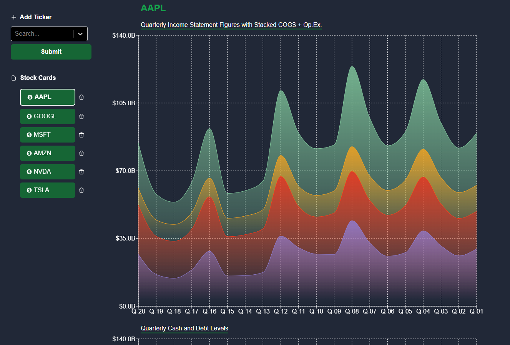

# StockCards IO

StockCards IO is a full-stack web application with a React frontend, Python-based FastAPI backend, and a NoSQL MongoDB. It's designed to help visualize trends in financial data for companies.

## Technologies Used

- React (Frontend)
- FastAPI (Python Backend)
- MongoDB (NoSQL Database)

## Features

- Easily visualize trends in financial data

## Getting Started

[Instructions on how to set up and run the project locally]

1. Frontend: Install the dependencies and run 'npm run build'
2. Backend: Build the docker image and run it in a container
3. Setup a local MongoDB
4. construct a .env that includes a QuickFS api key, and MongoDB server address (with credentials)
